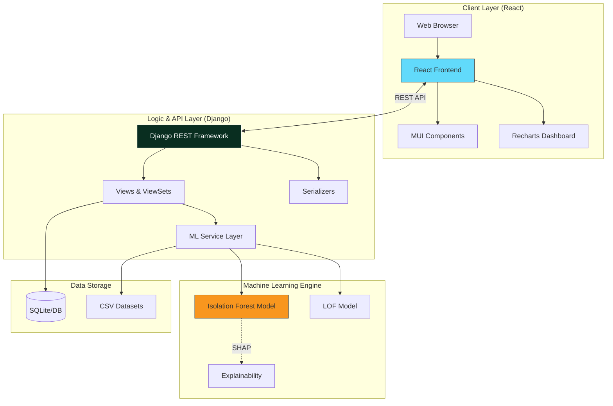

```mermaid
graph TD
    subgraph "Client Layer (React)"
        A[Web Browser] --> B[React Frontend]
        B --> C[MUI Components]
        B --> D[Recharts Dashboard]
    end

    subgraph "Logic & API Layer (Django)"
        B <-->|REST API| E[Django REST Framework]
        E --> F[Views & ViewSets]
        E --> G[Serializers]
        F --> H[ML Service Layer]
    end

    subgraph "Machine Learning Engine"
        H --> I[Isolation Forest Model]
        H --> J[LOF Model]
        I -.->|SHAP| K[Explainability]
    end

    subgraph "Data Storage"
        F --> L[(SQLite/DB)]
        H --> M[CSV Datasets]
    end

    style B fill:#61DAFB,stroke:#333
    style E fill:#092E20,stroke:#fff,color:#fff
    style I fill:#F8961E,stroke:#333
```