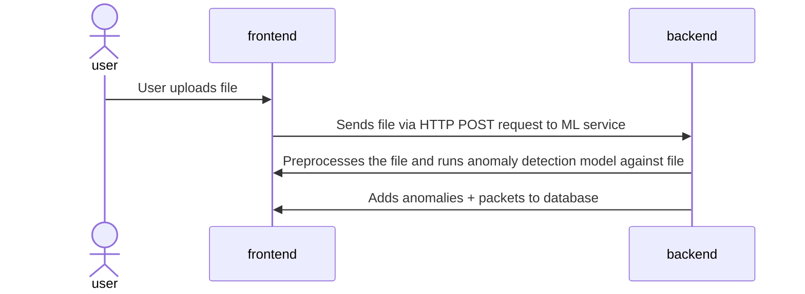

```mermaid
sequenceDiagram
    actor user
    participant frontend
    participant backend

    user ->> frontend: User uploads file 
    frontend ->> backend: Sends file via HTTP POST request to ML service
    backend ->> frontend: Preprocesses the file and runs anomaly detection model against file
    backend ->> frontend: Adds anomalies + packets to database
```