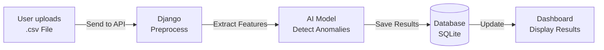

```mermaid
flowchart LR
    A["User uploads<br/>.csv File"] -->|Send to API| B["Django<br/>Preprocess"]
    B -->|Extract Features| C["AI Model<br/>Detect Anomalies"]
    C -->|Save Results| D[("Database<br/>SQLite")]
    D -->|Update| E["Dashboard<br/>Display Results"]
    
```