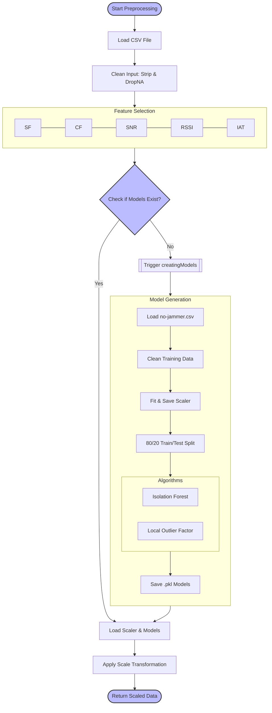

```mermaid
flowchart TD
    %% Main Preprocessing Flow
    Start([Start Preprocessing]) --> LoadCSV[Load CSV File]
    LoadCSV --> CleanIn[Clean Input: Strip & DropNA]
    
    subgraph FeatureSelection [Feature Selection]
        direction LR
        SF[SF] --- CF[CF] --- SNR[SNR] --- RSSI[RSSI] --- IAT[IAT]
    end
    
    CleanIn --> FeatureSelection
    FeatureSelection --> CheckExist{Check if Models Exist?}
    
    CheckExist -- Yes --> LoadScaler[Load Scaler & Models]
    CheckExist -- No --> CallTrain[[Trigger creatingModels]]
    
    %% Training Sub-flow
    subgraph Training [Model Generation]
        direction TB
        LoadTr[Load no-jammer.csv] --> CleanTr[Clean Training Data]
        CleanTr --> FitS[Fit & Save Scaler]
        FitS --> Split[80/20 Train/Test Split]
        
        subgraph Algos [Algorithms]
            direction LR
            IF[Isolation Forest]
            LOF[Local Outlier Factor]
        end
        
        Split --> Algos
        Algos --> SaveM[Save .pkl Models]
    end
    
    CallTrain --> Training
    Training --> LoadScaler
    
    LoadScaler --> Transform[Apply Scale Transformation]
    Transform --> End([Return Scaled Data])

    %% Styling
    classDef action fill:#f9f,stroke:#333,stroke-width:2px;
    classDef logic fill:#bbf,stroke:#333,stroke-width:2px;
    class Start,End logic
    class CheckExist logic
```