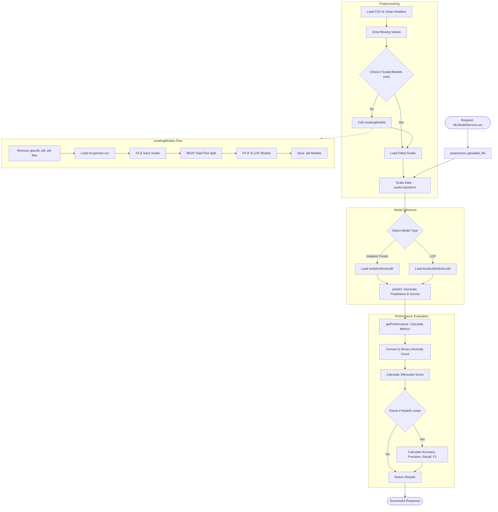

```mermaid
flowchart TD
    %% Main Entry Point
    Entry([Request: MLModelService.run]) --> Preprocess[preprocess uploaded_file]
    
    %% Preprocessing Logic
    subgraph Preprocessing [Preprocessing]
        LoadCSV[Load CSV & Clean Headers] --> DropNA[Drop Missing Values]
        DropNA --> CheckModels{Check if Scaler/Models exist}
        CheckModels -- No --> Train[Call creatingModels]
        CheckModels -- Yes --> LoadScaler[Load Fitted Scaler]
        Train --> LoadScaler
        LoadScaler --> ScaleData[Scale Data - scaler.transform]
    end
    
    Preprocess --> ScaleData
    ScaleData --> SelectModel{Select Model Type}
    
    %% Model Selection & Prediction
    subgraph Inference [Model Inference]
        SelectModel -- Isolation Forest --> LoadIF[Load isolationforest.pkl]
        SelectModel -- LOF --> LoadLOF[Load localoutlierfactor.pkl]
        
        LoadIF --> Predict[predict: Generate Predictions & Scores]
        LoadLOF --> Predict
    end
    
    Predict --> Performance[getPerformance: Calculate Metrics]
    
    %% Performance Metrics Logic
    subgraph Metrics [Performance Evaluation]
        Performance --> Binary[Convert to Binary Anomaly Count]
        Binary --> Silhouette[Calculate Silhouette Score]
        Silhouette --> CheckLabels{Check if NodeID exists}
        CheckLabels -- Yes --> Supervised[Calculate Accuracy, Precision, Recall, F1]
        CheckLabels -- No --> ReturnRes[Return Results]
        Supervised --> ReturnRes
    end
    
    ReturnRes --> End([Successful Response])

    %% Background Training Flow
    subgraph Training [creatingModels Flow]
        ClearOld[Remove specific old .pkl files] --> LoadBase[Load no-jammer.csv]
        LoadBase --> FitScale[Fit & Save Scaler]
        FitScale --> Split[80/20 Train/Test Split]
        Split --> FitModels[Fit IF & LOF Models]
        FitModels --> SaveModels[Save .pkl Models]
    end
    
    Train -.-> Training
```