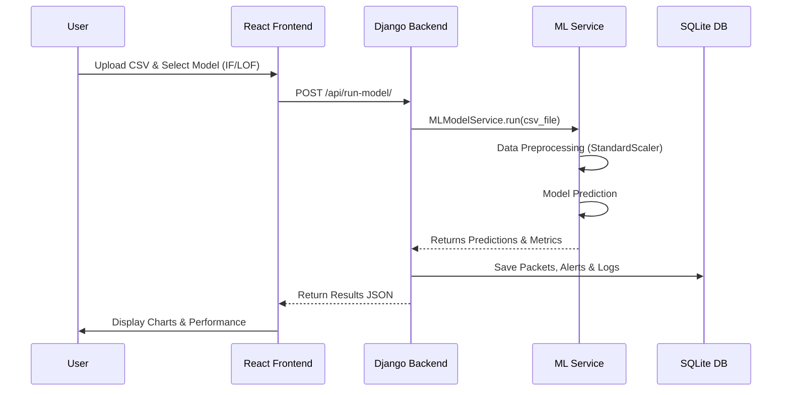

```mermaid
sequenceDiagram
    participant U as User
    participant F as React Frontend
    participant B as Django Backend
    participant ML as ML Service
    participant DB as SQLite DB

    U->>F: Upload CSV & Select Model (IF/LOF)
    F->>B: POST /api/run-model/
    B->>ML: MLModelService.run(csv_file)
    ML->>ML: Data Preprocessing (StandardScaler)
    ML->>ML: Model Prediction
    ML-->>B: Returns Predictions & Metrics
    B->>DB: Save Packets, Alerts & Logs
    B-->>F: Return Results JSON
    F->>U: Display Charts & Performance
```