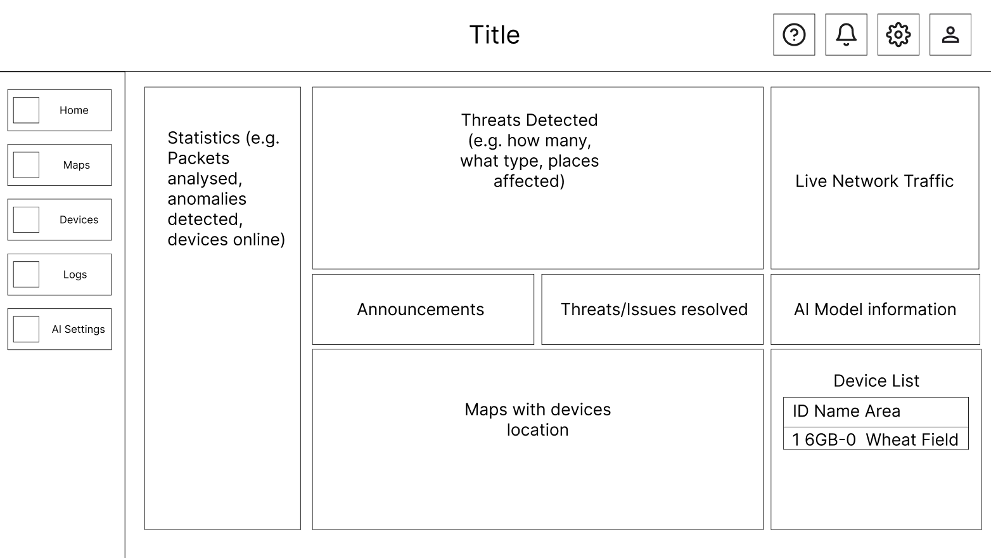
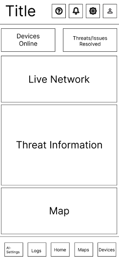

# Plan

## Contents

| Name of Page | Description |
| ----------- | ----------- |
| Header | Title |
| Paragraph | Text |

## Functional/Non-functional Requirements

### Functional

| Requirement | Description | Completed |
| :----------- | ----------- | :---------: |
| Working UI? | The UI needs to be functional | ☑️ |
| Paragraph | Text | |

### Non-Functional

| Requirement | Description | Completed |
| :----------- | ----------- | :---------: |
| Working UI? | The UI needs to be functional | ☑️ |
| Paragraph | Text | |

## Languages/Frameworks

### Front-end
- React/JavaScript -> Vite for installation
  - Dashboard and UI components
  - Chart.js
  - Need to use `react-router` for multi page applications

### Back-end
- Django
  - User authentication 
    - username and password/passkey (possibly) 
    - OAuth2 for google/microsoft login
  - DB management
    - MongoDB
  - API endpoints 
    - Swagger
    - FastAPI

### Machine learning
- Python
  - `pandas` + `numpy` for manipulating dataset
  - `scikit-learn` for machine learning model implementation

### Deployment
- Docker/Kubernetes 

## Design

## Dataset

- Timestamp
  - When the request occured
- Source IP
  - IP address of the client
- Destination IP
  - IP address of the server
- Source Port/Destination Port
  - Ports used for communication
- Protocol
  - HTTP, HTTPS, TCP, UDP
- Request Method
  - GET, POST
- URL/Path
  - Requested resource
- Status Code
  - Server Response -> 200, 404
- Bytes Sent/Received
  - Size of data transfer
- User Agent
  - Browser or client info

